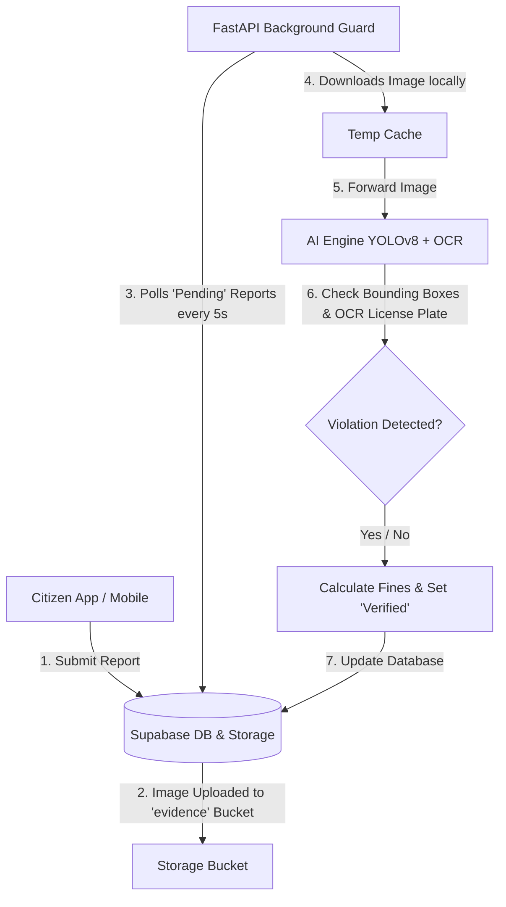

# 👁️ CivicEye Backend

[](https://fastapi.tiangolo.com/)
[](https://github.com/ultralytics/ultralytics)
[](https://supabase.com/)
[](https://www.python.org/)

> **Empowering smart cities with AI-driven, automated traffic violation detection and citizen-led reporting verification.**

CivicEye Backend is a high-performance Python service built with FastAPI that automates the verification of traffic violations. By combining custom YOLOv8 object detection, Tesseract OCR for license plate extraction, and Supabase backend services, it detects infractions like driving without a helmet, triple riding, and red-light violations in real-time, automatically updating databases and calculating fines.

---

## 🛠️ System Architecture



---

## ✨ Key Features

*   **🤖 Intelligent Violation Detection (YOLOv8):** Runs a custom-trained object detection model (`CivicEye_v1.pt`) to automatically classify complex traffic safety violations:
    *   **No Helmet:** Recognizes riders without safety helmets.
    *   **Triple Riding:** Detects three or more individuals on a single motorcycle.
    *   **Signal Jump:** Identifies motorcycles crossing intersections during active red traffic signals.
*   **🔍 License Plate OCR (OpenCV + Tesseract):** Dynamically crops license plate regions, applies preprocessing filters (grayscale transformation, 3x cubic interpolation resizing), and extracts alphanumeric sequences using Tesseract OCR.
*   **📡 Real-time Background Guard:** A lightweight background worker (running as a daemon thread inside FastAPI) that polls the database every 5 seconds for `Pending` reports, downloads evidence files, processes them through the AI Engine, and commits verification metrics.
*   **🔒 Secure User Authentication:** Full endpoint integration with Supabase Auth (`/auth/signup`, `/auth/login`) allowing role-based sessions for citizens and law enforcement officers.
*   **💰 Automated Fine Calculation:** Assigns custom municipal fine amounts depending on the severity and type of violation detected (e.g., ₹1000 for Signal Jumps, ₹1035 for Helmet violations, ₹1200 for Triple Riding).

---

## 📦 Tech Stack

| Category | Technology / Library | Description |
| :--- | :--- | :--- |
| **Core Framework** | **FastAPI** | Modern, high-performance web framework for Python APIs |
| **Server** | **Uvicorn** | Lightning-fast ASGI web server implementation |
| **Database & Auth**| **Supabase (Python SDK)** | Open-source Firebase alternative for DB, Auth, and Storage |
| **Object Detection**| **Ultralytics YOLOv8** | Advanced computer vision model for identifying riders & violations |
| **Image Processing**| **OpenCV (opencv-python)** | Real-time computer vision and image manipulation library |
| **Text Recognition**| **Tesseract OCR (pytesseract)** | Optical Character Recognition engine for reading license plates |
| **Configuration** | **Pydantic Settings** | Robust settings management using Python type annotations |

---

## 🔒 Environment Variables

Create a `.env` file in the root directory of the project and populate it with the following configuration keys:

```env
# Supabase Configuration
SUPABASE_URL=https://your-project-id.supabase.co
SUPABASE_KEY=your-supabase-service-role-or-anon-key

# Path to Tesseract Executable (Mandatory for OCR)
# Windows: C:\Program Files\Tesseract-OCR\tesseract.exe
# Linux: /usr/bin/tesseract
TESSERACT_PATH=C:\Program Files\Tesseract-OCR\tesseract.exe

# AI Model settings
MODEL_PATH=CivicEye_v1.pt

# Application Security
SECRET_KEY=your-super-secret-key-phrase
```

---

## ⚙️ Installation & Setup

### Prerequisites
1. **Python 3.8+** installed on your system.
2. **Tesseract OCR Engine** installed:
   * **Windows:** Download the installer from [UB Mannheim](https://github.com/UB-Mannheim/tesseract/wiki) and install to `C:\Program Files\Tesseract-OCR\`.
   * **macOS:** Install via Homebrew: `brew install tesseract`.
   * **Linux (Debian/Ubuntu):** Install via APT: `sudo apt-get install tesseract-ocr`.

### Steps

1. **Clone the Repository:**
   ```bash
   git clone https://github.com/Spoorthibeer/CivicEyeBackend.git
   cd CivicEyeBackend
   ```

2. **Create a Virtual Environment:**
   ```bash
   python -m venv venv
   # Activate on Windows:
   .\venv\Scripts\activate
   # Activate on macOS/Linux:
   source venv/bin/activate
   ```

3. **Install Dependencies:**
   ```bash
   pip install -r requirements.txt
   ```

4. **Verify Model File Placement:**
   Ensure the custom model file `CivicEye_v1.pt` is located in the root directory (or update `MODEL_PATH` in your `.env`).

5. **Start the FastAPI Application:**
   ```bash
   uvicorn app.main:app --reload
   ```
   The API will be available at `http://127.0.0.1:8000`. You can access the interactive Swagger documentation at `http://127.0.0.1:8000/docs`.

---

## 💡 Usage

### 1. Run AI Analysis Locally
You can run the engine programmatically within Python to test local images:
```python
from app.services.ai_engine import AIEngine

# Path to local image
image_path = "temp/test_violation.jpg"

# Extract results
violation, plate = AIEngine.process_image(image_path)
print(f"Violation: {violation}")
print(f"Detected License Plate: {plate}")
```

### 2. Primary API Endpoints

#### Authentication
*   **Sign Up:** `POST /auth/signup`
    *   Payload:
        ```json
        {
          "email": "citizen@domain.com",
          "password": "secure_password",
          "role": "citizen"
        }
        ```
*   **Login:** `POST /auth/login`
    *   Payload:
        ```json
        {
          "email": "police@domain.com",
          "password": "secure_password"
        }
        ```

#### On-Demand Analysis
*   **Manual Trigger:** `POST /reports/analyze/{report_id}`
    *   Forces immediate AI verification of a specific database report, downloading its evidence image, extracting violation indicators, calculating municipal fines, and updating its database record.

---

## 🤝 Contributing

Contributions make the open-source community an amazing place to learn, inspire, and create. Any contributions you make are **greatly appreciated**.

1. Fork the Project.
2. Create your Feature Branch (`git checkout -b feature/AmazingFeature`).
3. Commit your Changes (`git commit -m 'Add some AmazingFeature'`).
4. Push to the Branch (`git push origin feature/AmazingFeature`).
5. Open a Pull Request.

---

## 📄 License

Distributed under the MIT License. See [LICENSE](LICENSE) for more information.
